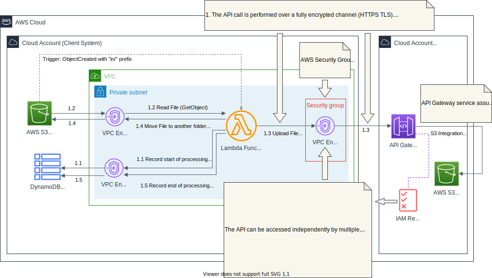

# Reference application (AWS) - transferring files over private REST API using serverless functions
This is a minimalistic application used to demonstrate an AWS-based implementation of a serverless function calling a private REST API hosted on AWS API Gateway using fine-grained authorisation.

## Architecture

When a new file is uploaded to the `in/` folder in the `Staging` Bucket, the **File Transfer Requester** Lambda function gets triggered.

In this way, for each new file, the **File Transfer Requester** Lambda function performs these steps:
1. Generate **File Processing UUID**
1. **Step 1.1** Creates a new Item in DynamoDB Table: 
    - Set the **File Processing UUID** as the item's primary key (`fileProcessingId`)
    - Set the following attributes: 
        - Start of Processing Timestamp (`startOfProcessing`)
        - Filename (`filename`)
        - File Size in Bytes (`fileSizeBytes`)
        - (optionally) File Version (`fileVersion`)
1. **Step 1.2** Read file contents
1. **Step 1.3** Upload the file (HTTP POST) to the file service
    - The service immediately returns a **File Transfer UUID**
1. **Step 1.4** Move file to the `accepted/` folder
    - Use `CopyObject` and `DeleteObject` AWS S3 APIs
1. **Step 1.5** Update the Item in DynamoDB Table: 
    - Use the **File Processing UUID** as the item's primary key (`fileProcessingId`)
    - Add the following attributes: 
        - **File Transfer UUID** (`fileTransferId`)
        - End of Processing Timestamp (`endOfProcessing`)

If at any stage the file processing fails, the file is moved to the `rejected` folder

## Security by Design

