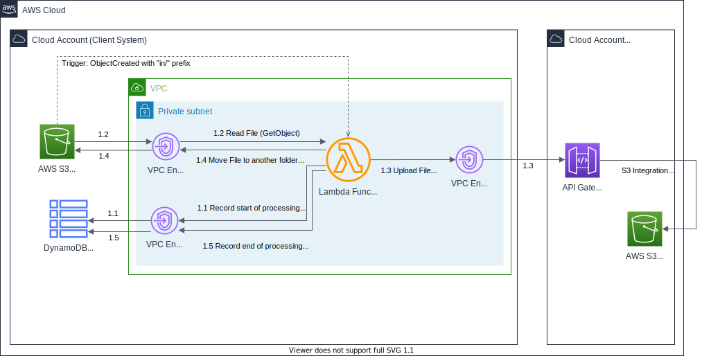

# Reference application (AWS) - calling private REST API using serverless functions
This is a cloud-native application used to demonstrate an AWS-based implementation of a serverless function calling a private REST API hosted on AWS API Gateway. The service call is done from within a private subnet over VPC endpoint and using fine-grained access control using IAM Resource Policy.

## Scenario
- One or more **client applications**, optionally scattered across different AWS cloud accounts, can submit files to a **shared service** using synchronous HTTP requests.
- The **shared service** exposes a REST API that is accessible only by the designated **client applications** from their private subnets over a secure network within AWS Cloud.

## API
- Each client application sends `HTTP POST` request with a file as binary payload in the request body.
- Each client can successfully send files to one, client-dedicated "client partition" only.
 


```yaml
# Part of infrastructure/file_service/openapi/openapi.yaml.tftpl
paths:
  /clients/{clientPartition}/orders/{orderIdentifier}:
    post:
      summary: Submit order for file transfer
      parameters:
        - name: clientPartition
          description: Client-specific Transfer Partition
          in: path
          required: true
          schema:
            type: string
        - name: orderIdentifier
          description: File Transfer Order Client-side Identifier
          in: path
          required: true
          schema:
            type: string     
      requestBody:
        description: File to be transferred
        required: false
        content:
          image/*:
            schema:
              $ref: "#/components/schemas/Binary"
```

## Architecture


When a new file is uploaded to the `in/` folder in the `Staging` Bucket, the **File Transfer Requester** Lambda function gets triggered.

In this way, for each new file, the **File Transfer Requester** Lambda function performs these steps:
1. Generate **File Processing UUID**
1. **Step 1.1** Creates a new Item in DynamoDB Table: 
    - Set the **File Processing UUID** as the item's primary key (`fileProcessingId`)
    - Set the following attributes: 
        - Start of Processing Timestamp (`startOfProcessing`)
        - Filename (`filename`)
        - File Size in Bytes (`fileSizeBytes`)
        - (optionally) File Version (`fileVersion`)
1. **Step 1.2** Read file contents
1. **Step 1.3** Upload the file (HTTP POST) to the file service
    - The service immediately returns a **File Transfer UUID**
1. **Step 1.4** Move file to the `accepted/` folder
    - Use `CopyObject` and `DeleteObject` AWS S3 APIs
1. **Step 1.5** Update the Item in DynamoDB Table: 
    - Use the **File Processing UUID** as the item's primary key (`fileProcessingId`)
    - Add the following attributes: 
        - **File Transfer UUID** (`fileTransferId`)
        - End of Processing Timestamp (`endOfProcessing`)

If at any stage the file processing fails, the file is moved to the `rejected` folder

## Security by Design


## Demo
This repository ships a full-working solution.

The code is split into two separate and independently-deployed "projects":
1. Service
    ```
      service
      └── infrastructure
          ├── file_transfer_service
          │   ├── main.tf
          │   ├── openapi
          │   │   └── openapi.yaml.tftpl
          │   ├── outputs.tf
          │   └── vars.tf
          ├── main.tf
          └── terraform.tf
    ```
1. Client
    ```
      client
      ├── applications
      │   └── fileTransferRequester
      │       ├── pom.xml
      │       └── src/main/java/io/github/mtjakobczyk/references/aws/serverless/FileTransferRequester.java
      └── infrastructure
          ├── client_system
          │   ├── main.tf
          │   ├── outputs.tf
          │   └── vars.tf
          ├── context.tf
          ├── main.tf
          ├── s3_triggered_lambda
          │   ├── main.tf
          │   └── vars.tf
          ├── terraform.tf
          └── vars.tf
    ```

Before you deploy anything, you need to consider where you would like to store the **Terraform State**.

If you wish to use AWS S3 then you need to: 
1. Uncomment the following line in all `terraform.tf` files:
    ```bash
    terraform {
    # backend "s3" { }
    }
    ```
1. Prepare the backend configuration `*.s3.tfbackend` for the service and for each client. Here is how such file looks like:
    ```
    region  =   "eu-west-1"
    bucket  =   "PUT_HERE_BUCKET_NAME"
    key     =   "PUT/HERE/BUCKET.tfstate"
    ```

## Deployment
### 1. Service
#### 1.1 Infrastructure
First and foremost, set the proper AWS CLI profile that points to your AWS Account which will host the service:
```bash
export AWS_PROFILE=PUT_HERE_SERVICE_ACCOUNT_PROFILE
export AWS_REGION=PUT_HERE_SERVICE_ACCOUNT_REGION
```
**Hint:** If you store Terraform state in AWS S3 you have to set:
```bash
export TF_CLI_ARGS_init="-backend-config=PUT_HERE_PATH_TO_tfbackend"
```

First, deploy only the file transfer service.
```bash
cd service/infrastructure
teraform init
teraform apply 
# IF ASSUMING ROLE WITH MFA YOU CAN USE: 
# ../../scripts/sts-teraform.sh
```
The list of registered clients is initially empty (because part of it is commented out):
```yaml
# part of service/infrastructure/file_service.tf
locals {
  registered_clients = [
    # {
    #   client_partition = "PUT_HERE_PARTITION_NAME"
    #   vpc_endpoint = "PUT_HERE_VPCE"
    # }
  ]
}
```
Because the list is initially empty, the "deny all" IAM Resource Policy (`data.aws_iam_policy_document.default_deny_all.json`) gets attached to the REST API on API Gateway. See `aws_api_gateway_rest_api_policy.file_ingestion.policy`. This is fine at this stage. :)


The clients will need to know the service endpoint. Let's save it to a variable:
```bash
SERVICE_DNS_NAME=$(teraform output service_dns_name)
```

### 2. Sample Client
#### 2.1 Application
Compile and package the serverless function:
```bash
cd client/applications/fileTransferRequester
mvn package
```
This produces the function package (`.jar`):
```
client/applications/fileTransferRequester/target/file-transfer-requester-1.0-SNAPSHOT.jar
```

#### 2.2 Infrastructure
Now, let's deploy the components (cloud infrastructure and Lambda) of a sample client system.

Set the proper AWS CLI profile that points to your AWS Account which will host __the client system__:
```bash
export AWS_PROFILE=PUT_HERE_CLIENT_1_PROFILE
export AWS_REGION=PUT_HERE_CLIENT_1_REGION
```
**Hint:** If you store Terraform state in AWS S3 you have to set:
```bash
export TF_CLI_ARGS_init="-backend-config=PUT_HERE_PATH_TO_tfbackend"
```

As we provision the infrastructure, do not forget to pass the client name, client partition and the REST API's DNS name as Terraform variable:
```bash
cd client/infrastructure
teraform init
teraform apply -var="file_ingestion_api_dns_name=$SERVICE_DNS_NAME" -var="client_name=one" -var="client_partition=one"
# IF ASSUMING ROLE WITH MFA YOU CAN USE: 
# ../../scripts/sts-teraform.sh
```
Note down the VPC Endpoint ID (`vpce_id`). You will need it in a few moments:
```
Outputs:
vpce_id = "vpce-08*************8d"
```

1. The Lambda is **triggered** by each newly created file added to the `in/` folder inside the `...-client-...-staging` bucket
1. The Lambda is configured to HTTP POST this file as binary payload to a REST API on API Gateway
      - The REST resource path: `/clients/{clientPartition}/orders/{orderIdentifier}`
      - The `client_partition` variable value `one` is used as `{clientPartition}` (See `CLIENT_PARTITION` environment variable set for Lambda)
      - The filename is set as `{orderIdentifier}`

As soon as the Terraform run completes, you can perform a first test, which will... fail, because the client has not been registered in the service yet.

#### 2.3 Smoke Test (failing)
- Just put some image file to the `in/` folder of the `...-client-...-staging` bucket and wait a bit.
- After a few seconds, the file should be moved to the `rejected/` folder in the same bucket

If you look into CloudWatch, you will see entries saying:
```
STATUS 403
STATUS TEXT Forbidden 
BODY User: anonymous is not authorized to perform: execute-api:Invoke on resource (...)/v1/POST/clients/one/orders/(...) with explicit deny
```

#### 2.4 Registering a new client
Change the context to the service account (set again the proper AWS CLI profile that points to your AWS Account which **hosts the service**):
```bash
export AWS_PROFILE=PUT_HERE_SERVICE_ACCOUNT_PROFILE
export AWS_REGION=PUT_HERE_SERVICE_ACCOUNT_REGION
```
**Hint:** If you store Terraform state in AWS S3 you have to set:
```bash
export TF_CLI_ARGS_init="-backend-config=PUT_HERE_PATH_TO_tfbackend"
```

In the `service/infrastructure/main.tf` **uncomment** the entry for the newly added client (in the `local.registered client` list) and provide a value for `vpc_endpoint` (it was output as you provisioned the client):
```yaml
locals {
  registered_clients = [
    {
      client_partition = "one"
      vpc_endpoint = "vpce-08*************8d"
    }
  ]
}
```

Now, just apply changes.
```bash
teraform apply
# IF ASSUMING ROLE WITH MFA YOU CAN USE: 
# ../../scripts/sts-teraform.sh
```
There will be following changes performed:
```
...
Plan: 1 to add, 3 to change, 1 to destroy.
...
```

If you want, you can look at the REST API in AWS Console. The Resource Policy has been updated and the VPC Endpoint ID is connected to the Private Endpoint.


#### 2.5 Test 1 (succeeding)
- Put some other or the same image file to the `in/` folder of the `...-client-...-staging` bucket and wait a bit.
- After a few seconds, the file should be moved to the `accepted/` folder in the same bucket
- Furthermore, you should a copy of the same file in the `one/*/` subfolder of the `...-file-ingestion` bucket. The API Gateway placed there the copy.

This time, if you look into CloudWatch, you will see entries saying:
```
STATUS 202
STATUS TEXT Accepted 
```


#### 2.5 Test 2 (failing)
In the `service/infrastructure/main.tf` file, change the `client_partition` to `notone`:
```yml
locals {
  registered_clients = [
    {
      client_partition = "notone"
#...
    }
  ]
}
```
Apply changes:
```bash
teraform apply
# IF ASSUMING ROLE WITH MFA YOU CAN USE: 
# ../../scripts/sts-teraform.sh
```

- Put some other or the same image file to the `in/` folder of the `...-clientOne-staging` bucket and wait a bit.
- After a few seconds, the file should be moved to the `rejected/` folder in the same bucket
- You will *not* find any copy of the file in the `two/*/` subfolder of the `...-file-ingestion` bucket

Furthermore, if you look into CloudWatch, you will see entries saying:
```
STATUS 403
STATUS TEXT Forbidden 
BODY User: anonymous is not authorized to perform: execute-api:Invoke on resource (...)/v1/POST/clients/**two**/orders/(...)
```


#### Postscriptum
If you need to let other clients use their dedicated paths (`/clients/two/*` or `/clients/three/*`), you just add the relevant object to the list (as shown below) and apply Terraform changes (which will amend the IAM resource policy and allow the VPC Endpoint to access the private endpoint of API Gateway):
```yaml
locals {
  registered_clients = [
    {
      client_partition = "one"
      vpc_endpoint = "vpce-08*************8d"
    },
    {
      client_partition = "two"
      vpc_endpoint = "vpce-05*************2a"
    },
    {
      client_partition = "three"
      vpc_endpoint = "vpce-06*************3c"
    }
  ]
}
```
